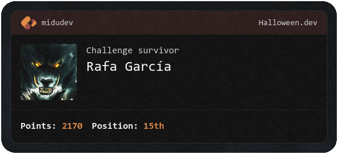

# [Halloween.dev](https://www.halloween.dev/) solutions

This repository contains my solutions for the five _Halloween.dev_ (2024 edition) challenges, an initiative created by [@midudev](https://github.com/midudev).

## Challenges

| #   | Challenge                      |                Solution                 |
| --- | ------------------------------ | :-------------------------------------: |
| 1   | Create the perfect potion      | [solution](./challenges/01/solution.js) |
| 2   | Zombie Horde                   | [solution](./challenges/02/solution.js) |
| 3   | Escape from Freddy's nightmare | [solution](./challenges/03/solution.js) |
| 4   | Find the killer                | [solution](./challenges/04/solution.js) |
| 5   | Terror on Pyramid Head         | [solution](./challenges/05/solution.js) |

## Final score

